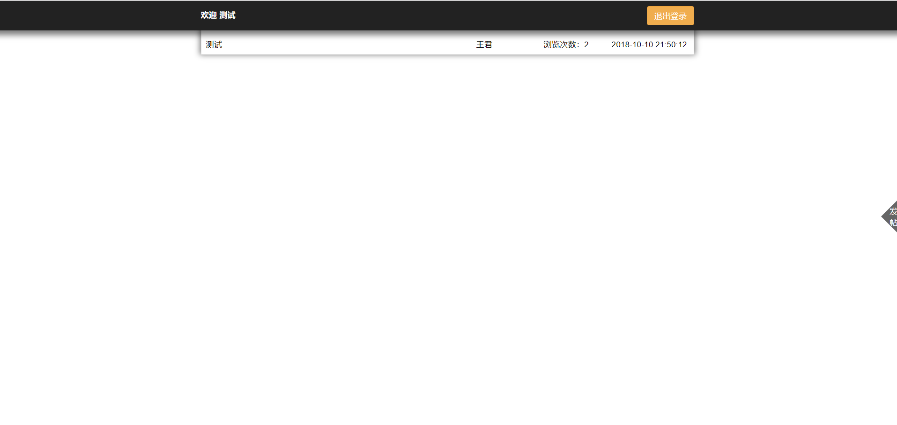
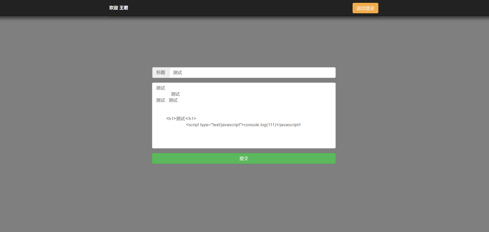
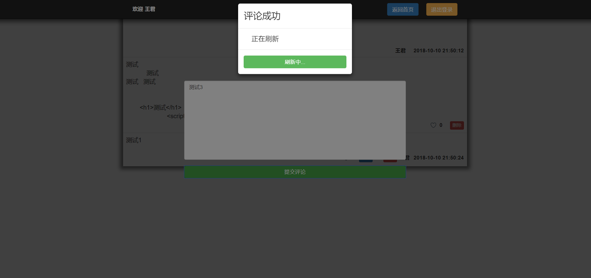
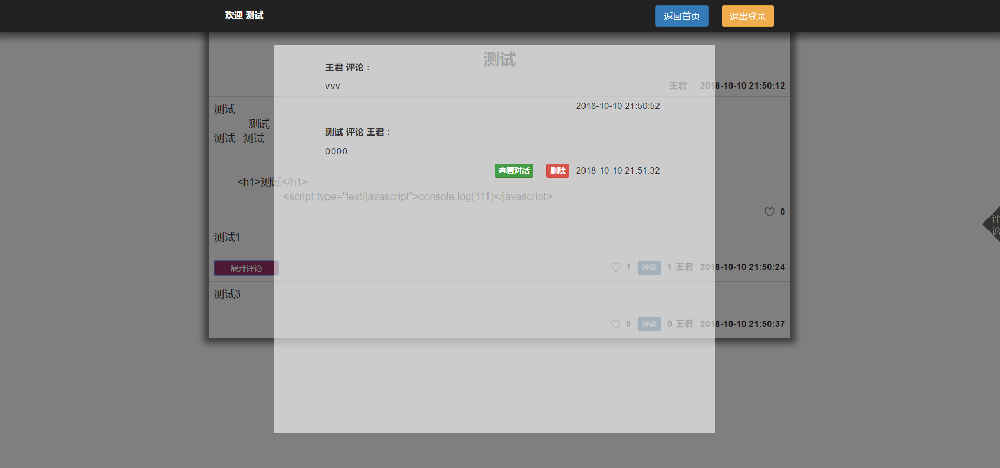

# BBS论坛
----  
## 安装  
```
npm install
```
----
## 使用方法   
* 在node中使用,运行文件目录中的app.js文件
```
node app.js
```
* 或者直接在vscode中调试app.js文件
----  
<table>
    <tr>
        <td ><center>登录页 </center></td>
        <td ><center>home页</center></td>
        <td ><center>发帖</center></td>
    </tr>
     <tr>
        <td ><center>测试页 </center></td>
        <td ><center>评论 </center></td>
        <td ><center>查看对话</center></td>
    </tr>
</table>

---------------------
## 简要说明  
* 主要使用node的express模块,sqlite数据库模块,解析前端提交的AJAX请求,并对数据库进行相应的操作,BBS主要实现了用户的注册、登录、发帖、删帖、评论帖子、评论帖子评论的功能,细节方面增加了文章浏览次数、点赞次数以及查看对话等功能。前端主要通过AJAX进行局部刷新,同时还增加了响应式适配。  
* 想到但是暂时没有时间实现的功能。  
    1. 用户详情页  
    2. 未登录浏览帖子功能  
    3. 置顶功能  
    4. 消息通知  
    5. 头像
